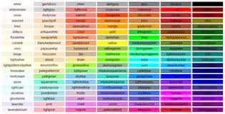

<<<<<<< HEAD
## Operators

Operators are used for JavaScript’s arithmetic expressions, comparison expressions, logical expressions, assignment expressions, and more.
Note that most operators are represented by punctuation characters such as + and =. Some, however, are represented by keywords such as delete and instanceof. Keyword operators are regular operators, just like those expressed with punctuation; they simply have a less succinct syntax.

++   
Pre- or post-increment

--   
Pre- or post-decrement

-

Negate number

+

Convert to number

~

Invert bits

!

Invert boolean value

delete

Remove a property

typeof

Determine type of operand

void

Return undefined value

**

Exponentiate

*, /, %

Multiply, divide, remainder

+, -

Add, subtract

+

Concatenate strings

<<

Shift left

>>

Shift right with sign extension

>>>

Shift right with zero extension

<, <=,>, >=

Compare in numeric order

<, <=,>, >=

Compare in alphabetical order

instanceof

Test object class

in

Test whether property exists

==

Test for non-strict equality

!=

Test for non-strict inequality

===

Test for strict equality

!==

Test for strict inequality

&

Compute bitwise AND

^

Compute bitwise XOR

|

Compute bitwise OR

&&

Compute logical AND

||

Compute logical OR

??

Choose 1st defined operand

?:

Choose 2nd or 3rd operand

=

Assign to a variable or property

## loops

Loops can execute a block of code a number of times.

Loops are handy, if you want to run the same code over and over again, each time with a different value

## types of loops

1- for 
syntax

for (statement 1; statement 2; statement 3) {
  // code block to be executed
}

2- while

The while loop loops through a block of code as long as a specified condition is true.

syntax

while (condition) {
  // code block to be executed
}

=======
# what is css

CSS stands for Cascading Style Sheets · CSS describes how HTML elements are to be displayed on screen, paper, or in other media 

# Three Ways to Insert CSS
There are three ways of inserting a style sheet:
<ul>
<li>External CSS </li>
<li>Internal CSS </li>
<li>Inline CSS  </li>
</ul>

# External css

With an external style sheet, you can change the look of an entire website by changing just one file!

Each HTML page must include a reference to the external style sheet file inside the <link> element, inside the head section.

# Internal css

An internal style sheet may be used if one single HTML page has a unique style.

The internal style is defined inside the <style> element, inside the head section.
 
#Inline css

An inline style may be used to apply a unique style for a single element.

To use inline styles, add the style attribute to the relevant element. The style attribute can contain any CSS property.

# css colors

syntax

color: color|initial|inherit;

>>>>>>> 036d559ffec17314a5cc24f6e147e670eb7055e0
